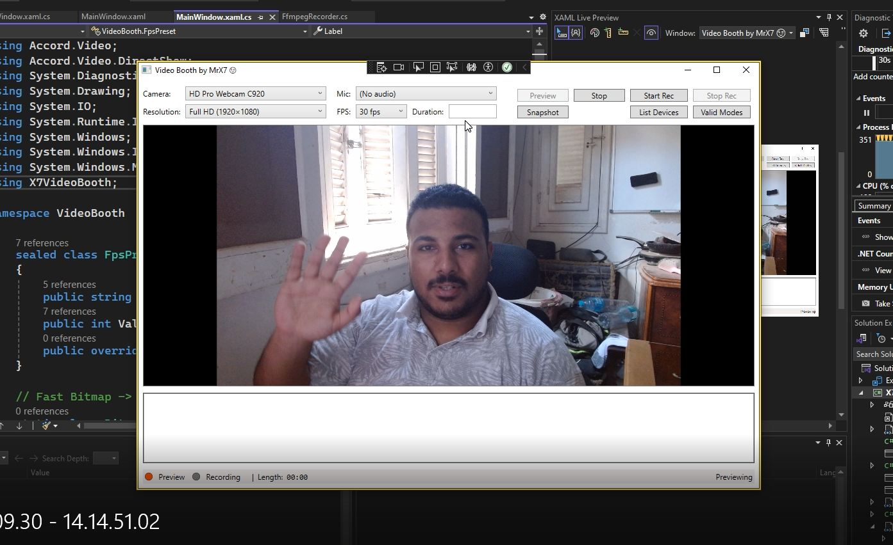

# X7VideoBooth (PoC)

A lightweight **Windows video-booth** app built with **WPF (.NET)**.  
It previews your webcam, records with **FFmpeg**, and adds practical booth UX (countdown, lamps, timer, logs, snapshots).

> **Status:** Proof-of-Concept. Code is intentionally straightforward (no MVVM yet) so .NET devs can read and tinker quickly.

 <!-- replace with a real screenshot when ready -->

---

## Table of Contents

- [Features](#features)
- [Why a PoC](#why-a-poc)
- [Architecture at a Glance](#architecture-at-a-glance)
- [Requirements](#requirements)
- [Getting Started](#getting-started)
- [Usage](#usage)
- [Tips for Smooth “Real 30 fps”](#tips-for-smooth-real-30-fps)
- [How Recording Works](#how-recording-works)
- [Troubleshooting](#troubleshooting)
- [What’s Missing (Booth Must-Haves)](#whats-missing-booth-must-haves)
- [Roadmap (Suggested Order)](#roadmap-suggested-order)
- [Project Structure](#project-structure)
- [Contributing](#contributing)
- [License & Trademark](#license--trademark)
- [Credits](#credits)
- [FAQ](#faq)

---

## Features

- **Webcam preview** via Accord.Video.DirectShow
- **Start / Stop** preview and recording
- **Pick microphone** or **(No audio)** for video-only
- **Stable FFmpeg pipeline**
  - Combined DirectShow input (`video="…":audio="…"` or video-only)
  - CFR (e.g., 29.97/30), `yuv420p`, `-fflags +genpts`, `-movflags +faststart`
- **Countdown overlay** (3-2-1), **status lamps** (Preview/Recording), **elapsed timer**
- **Max duration** (auto-stop) support
- **Snapshot** to JPG/PNG/BMP
- **Device helpers:** list devices, probe valid camera modes (via FFmpeg)
- **Log pane** with FFmpeg/app output
- **Video Introduction**: https://youtu.be/v1jEiK-X7nQ

---

## Why a PoC

This repo shows a minimal, dependable Windows recording flow that balances **lip-sync** and **compatibility** without heavy frameworks. It’s a clean starting point for kiosk/event “video booths,” and an easy codebase to fork. The app is intentionally **code-behind first**; once the features stabilize, it can be organized into MVVM.

---

## Architecture at a Glance

- **WPF UI** (code-behind): direct and readable, no MVVM yet.
- **Preview**: Accord.Video.DirectShow captures frames for the on-screen preview.
- **Recording**: FFmpeg runs as a child process (via `FfmpegRecorder.cs`) using a combined DirectShow graph for video (+ optional audio).
- **Sync & Compatibility**: CFR + `aresample=async=1` + `yuv420p` + `+genpts`/`+faststart` → good playback and proper Windows thumbnails.

---

## Requirements

- **Windows 10/11**
- **Visual Studio 2022** (recommended) or recent `dotnet` SDK with WPF workload
- **FFmpeg**: `ffmpeg.exe` on `PATH` **or** next to the app’s `.exe` (That is already provided in the solution path)
- **NuGet**: `Accord.Video.DirectShow`

> Put `ffmpeg.exe` beside your built `.exe` or install FFmpeg and add it to `PATH`.

---

## Getting Started

Open the solution in **Visual Studio 2022**.

Restore NuGet packages and build.

Place **ffmpeg.exe** next to the built `.exe` (or ensure it’s on **PATH**).

Run the app.

```bash
git clone https://github.com/xx7Ahmed7xx/X7VideoBooth_PoC.git
```

---

## Usage

- Choose **Camera** and **Mic** (or select **(No audio)** for video-only).
- Click **Preview** to verify video is live.
- Click **Start Rec** → the **countdown** runs → recording starts.
- Watch **status lamps** and **timer** (max duration auto-stops if configured).
- Click **Stop Rec** → an **MP4** is saved (fast-start for web/players).
- Use **Snapshot**, **List Devices**, **Valid Modes**, and the **Log** as needed.

---

## Tips for Smooth “Real 30 fps”

- Improve **lighting**; disable **auto-exposure** and target ~**1/60 s** exposure.
- Prefer **720p** on older cameras when **1080p** drops frames.
- Plug cams/mics directly into a **dedicated USB port** (avoid hubs).

---

## How Recording Works

- **Input:** `-i video="YourCam":audio="YourMic"` *(or video-only)*.
- **Video** normalized to **CFR** with an `fps=` gate + `-vsync cfr`.
- **Audio** gently tracks video with `aresample=async=1:osr=48000`.
- **Output:** `libx264`, `-crf 20`, `-preset veryfast`, `-pix_fmt yuv420p`, `-fflags +genpts`, `-movflags +faststart`.

This combination yields good lip-sync, sensible file size, broad player compatibility, and proper Windows thumbnails.

---

## Troubleshooting

### No thumbnail / WMP oddities
- Ensure `-pix_fmt yuv420p` and `-movflags +faststart` (already used).

### File shows ~15 fps even when 30 selected
- That’s often the **camera’s effective rate** with long exposure/low light.
- Improve lighting or switch to **720p**; lock exposure around **1/60 s**.

### Stutter / desync
- Keep **VBR** and `aresample=async=1`.
- Use **dedicated USB** ports and better lighting.

### Hardware encoders (NVENC/QSV/AMF)
- PoC defaults to **x264** for wide compatibility. You can add hardware paths later.

---

## What’s Missing (Booth Must-Haves)

This is a PoC. Typical **event-ready** features you may add:

- **Autosave & naming template** (Event/Date folders; skip SaveFileDialog for kiosk)
- **Kiosk mode** (borderless fullscreen, TopMost, cursor auto-hide, hotkey to exit)
- **Pre-flight checks** (ffmpeg present, camera/mic found, free disk space)
- **Audible cues** (beep countdown, end chime)
- **Audio VU meter** and simple mic test
- **Branding / watermark overlay** (FFmpeg `overlay` or post-step)
- **Consent screen** (for public events), simple JSON consent log
- **Settings persistence** (JSON in `%AppData%\\X7VideoBooth`)
- **Auto-cleanup** (delete files older than N days)
- **Exposure/white balance controls** (DirectShow/IAM)
- **Hotkeys** & **device hot-plug refresh**
- **Crash-safe logging** (rolling logs to file)

---

## Roadmap (Suggested Order)

1. Review flow (Retake / Keep)  
2. Autosave naming + EventName + BaseFolder (Settings UI/JSON)  
3. Kiosk mode (borderless, autosave, cursor hide, TopMost)  
4. Pre-flight checks (ffmpeg/devices/disk)  
5. Beep countdown & end chime  
6. Audio VU (optional)  
7. Consent toggle (if used publicly)

---

## Project Structure

```
X7VideoBooth_PoC/
  ├─ VideoBooth/
  │   ├─ MainWindow.xaml / MainWindow.xaml.cs   # UI + code-behind (PoC, no MVVM)
  │   ├─ FfmpegRecorder.cs                      # Thin wrapper to build/run ffmpeg
  │   └─ (helpers)
  └─ docs/
      └─ screenshot1.png
```

> Intentional: **no MVVM yet**. PRs that improve structure are welcome, but please keep the entry path simple for new .NET devs.

---

## Contributing

- Issues and PRs welcome!  
- Keep PRs **small and focused**.  
- For larger changes (MVVM, DI, major recording architecture), please open an issue first to discuss direction.

---

## License & Trademark

- **Free & source-available; non-commercial use only.**  
  Professional/commercial usage **requires permission** from the author.
- The **“X7VideoBooth”** name, **“Video Booth by MrX7”**, and any included branding are **trademarks** of the author.  
  Do not remove trademark notices in the code/UI when redistributing binaries.
- If you fork for learning or personal projects, please keep attribution intact.

> Note: Because it restricts commercial use, this does **not** match the OSI definition of “open source.” If you need a commercial license, please open an issue.

---

## Credits

- **FFmpeg** — the workhorse encoder/transcoder  
- **Accord.NET** — DirectShow capture made approachable  
- Community members filing issues and PRs ❤️

---

## FAQ

**Is the code “good” for a PoC?**  
Yes—clear and direct on purpose. It hasn’t been organized into MVVM yet; feel free to send incremental PRs that improve structure without sacrificing readability.

**Why not keep the live preview during recording?**  
For reliability. Many webcams/drivers dislike dual-open, and piping preview frames to FFmpeg adds CPU/complexity. The PoC uses a stable path: stop the live feed while recording, keep the last frame visible, show lamps/timer, then restore preview.

**Can I add NVENC/QSV/AMF?**  
Sure—detect availability and swap `-c:v` plus per-encoder options. Keep `yuv420p`, `+genpts`, and your CFR/VFR choice consistent.

**Which .NET version?**  
Any modern WPF-capable .NET with Visual Studio 2022 is fine; the focus here is the capture/FFmpeg flow rather than framework specifics.
